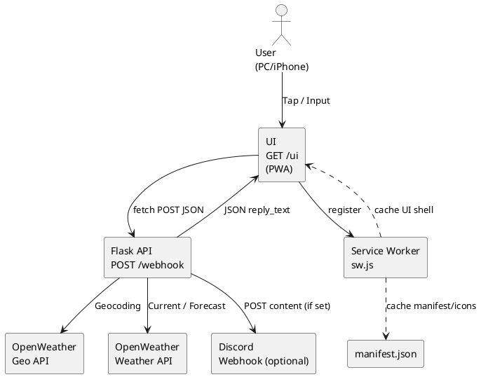
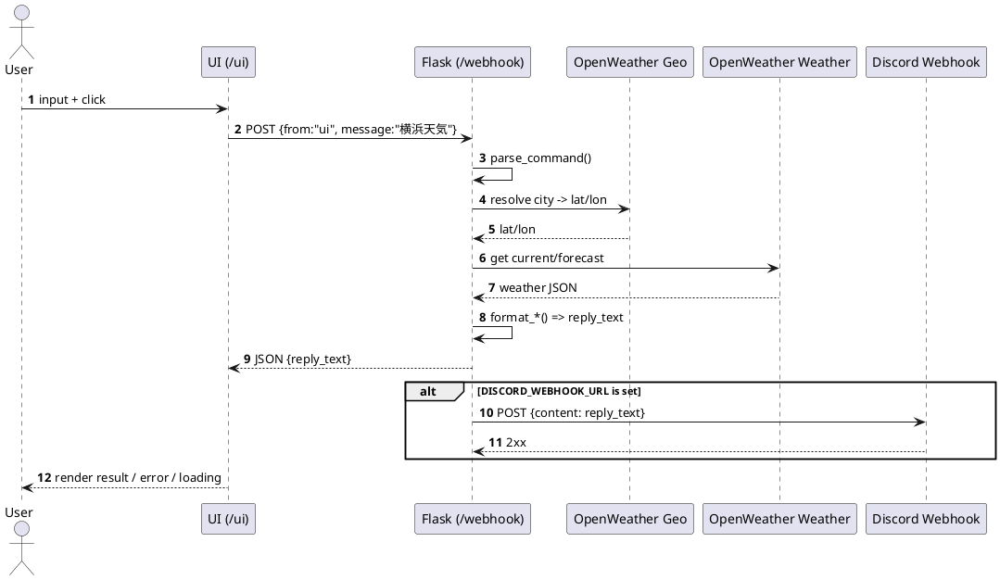

## README.md（Markdown整形版・1ページ）

````md
# Weather Console (Flask + OpenWeather + Discord + PWA)

iPhone / PC から「天気コマンド」を実行し、結果を画面に表示しつつ Discord にも投稿する小型アプリです。  
PWA 対応のため、iPhone ではホーム画面に追加して“アプリっぽく”使えます。

---

## できること

- `/ui`：コマンド入力UI（PC/iPhone）
- `/webhook`：API（UI から POST を受けて天気取得 → JSON で返す）
- OpenWeather で天気取得（地名→緯度経度→現在天気/予報）
- 結果を Discord Webhook に投稿（任意）
- PWA（manifest / Service Worker）

---

## ざっくり構成

- UI（/ui）＝「リモコン」  
- /webhook ＝「司令室（頭脳）」  
- OpenWeather ＝「気象データ提供」  
- Discord ＝「掲示板」

UI は薄く、天気ロジックはすべてサーバー側（/webhook）に集約しています。

---

## エンドポイント

- `GET /` → `/ui` にリダイレクト
- `GET /ui` → UI（HTML）表示
- `POST /webhook` → コマンド処理して JSON 返却
- `GET /static/...` → manifest / sw.js / icons など配信
- `GET /ping` → `pong`（死活確認）

---

## コマンド例

入力例（スペース不要）：

- `横浜天気`：今日の天気
- `東京週間天気`：今後5日（OpenWeather無料枠の基本）
- `千曲傘`：傘が必要か
- `白馬寒さ`：体感温度ベースの寒さ
- `箱根服装`：服装アドバイス
- `東京`：都市名だけの場合は「天気」扱い（都市チップと同じ思想）

---

## /webhook の入出力

### 入力（UI → サーバー）
```json
{ "from": "ui", "message": "横浜天気" }
````

### 出力（サーバー → UI）

```json
{
  "status": "ok",
  "mode": "today",
  "city": "Yokohama",
  "reply_text": "【天気】 Yokohama (JP) ...",
  "sent_to_discord": true
}
```

---

## 内部処理（流れ）

1. UI が `/webhook` に POST（JSON）
2. `/webhook` が `parse_command()` で intent / city を決定
3. `ow_geo()`：地名 → 緯度経度（Geocoding API）
4. `ow_current()`：現在天気取得（/weather）
5. 週間の場合は `ow_forecast()`（/forecast）
6. `format_today()` 等で “人間向けの文章” に整形
7. UI に JSON で返す
8. `DISCORD_WEBHOOK_URL` があれば同文を Discord へ投稿

---

## UX（現状の工夫）

* 通信中はフルスクリーンローディング（「通信中…」）
* オフライン検知で実行を止め、バナー表示
* 12秒でタイムアウト（AbortController）
* サーバー側は「例外でも JSON を返す」方針（UI の JSON パース事故を避ける）
* Service Worker は **POST /webhook を絶対にキャッシュしない**（安全優先）

---

## PWA（manifest / sw.js）

* `manifest.json`：アプリ名/アイコン/起動URL（start_url=/ui）
* `sw.js`：UIシェルと静的ファイルをキャッシュ

  * HTML は network-first
  * 静的ファイルは cache-first
  * **/webhook（POST）は触らない**

---

## 必要な環境変数

| 変数名                   | 必須 | 内容                    |
| --------------------- | -: | --------------------- |
| `OPENWEATHER_API_KEY` |  ✅ | OpenWeather API Key   |
| `DISCORD_WEBHOOK_URL` | 任意 | Discord Webhook URL   |
| `PORT`                | 任意 | Flask ポート（デフォルト 8787） |

---

## 起動（例）

```bash
python weather_console_app_v2_fixed4.py
# http://localhost:8787/ui
```

同一LANの iPhone から使う場合：

* PC の IP が `192.168.x.x` なら `http://192.168.x.x:8787/ui`

---

## 将来拡張（アイデア）

* 自動投稿（毎朝の天気を Discord へ）：最も手堅い通知
* エラー表示の原因分岐（error_code を追加）
* コマンド履歴（localStorage）
* Web Push（PWA通知：難易度高め）

````

---

## 図（Mermaid）

### 1) ブロック図（構成）
```mermaid
flowchart LR
  U[User<br/>PC / iPhone] -->|Tap / Input| UI[/GET /ui<br/>UI (PWA)/]
  UI -->|fetch POST JSON| WH[/POST /webhook<br/>Flask API/]

  WH -->|Geocoding| GEO[OpenWeather<br/>Geo API]
  WH -->|Current/Forecast| OWM[OpenWeather<br/>Weather API]

  WH -->|JSON reply_text| UI
  WH -->|POST content| D[Discord Webhook<br/>(optional)]

  UI --> SW[Service Worker<br/>sw.js]
  UI --> M[manifest.json]
  SW -. cache .-> UI
  SW -. cache .-> M
````

### 2) シーケンス図（情報の流れ）

```mermaid
sequenceDiagram
  autonumber
  actor User
  participant UI as /ui (Browser/PWA)
  participant WH as /webhook (Flask)
  participant GEO as OpenWeather Geo
  participant OWM as OpenWeather Weather
  participant DIS as Discord Webhook

  User->>UI: コマンド入力/ボタン押下
  UI->>WH: POST {from:"ui", message:"横浜天気"}
  WH->>WH: parse_command()
  WH->>GEO: 地名→緯度経度
  GEO-->>WH: lat/lon
  WH->>OWM: 天気取得（current/forecast）
  OWM-->>WH: weather JSON
  WH->>WH: format_*()で文章生成
  WH-->>UI: JSON {reply_text: "..."}
  alt DISCORD_WEBHOOK_URLが設定されている
    WH->>DIS: POST {content:"..."}
    DIS-->>WH: 2xx
  end
  UI-->>User: 画面表示（成功/失敗/ローディング）
```

---

## 図（PlantUML）

### 1) ブロック図（構成）



### 2) シーケンス図（情報の流れ）



